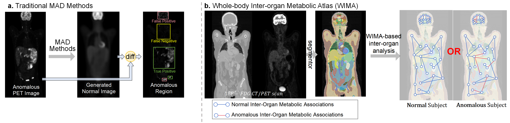
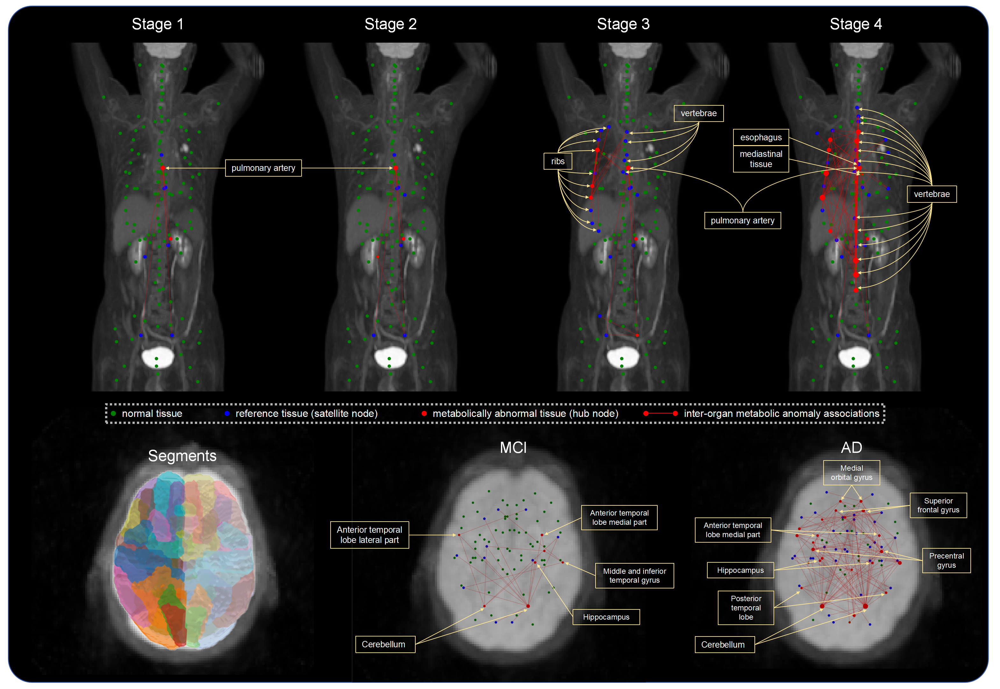

# Total-Body ${}^{18}$F-FDG PET Metabolic Connectomics



**A Whole-Body Inter-Organ Metabolic Atlas (WIMA) Framework for Anomaly Detection and Systemic Analysis**

Medical anomaly detection (MAD) in PET/CT is critical for diagnosing and planning treatments for a broad range of systemic diseases. However, existing deep learning–based approaches (e.g., Autoencoders, GANs) often struggle with the high noise inherent in PET scans and fail to learn robust normal representations, leading to overfitting and "black box" decisions.

To address these challenges, we propose a novel framework that integrates **Metabolic Connectomics** into anomaly detection by constructing a **Whole-body Inter-Organ Metabolic Atlas (WIMA)**. By leveraging the Reference Metabolic Connectome (RMC) derived from healthy controls, our method captures thousands of inter-organ metabolic associations. Unlike traditional deep learning methods, this atlas provides **transparent, biologically interpretable** explanations for anomaly classification.

We evaluate this framework on **Alzheimer’s disease (AD)**, **Cancer (lymphoma, melanoma, lung cancer)**, and **Epilepsy**, demonstrating superior detection performance and revealing distinct whole-person metabolic fingerprints across diverse pathologies.

---

## 🌟 Features

- **Reference Metabolic Connectome (RMC)**  
  A novel atlas constructed from whole-body ${}^{18}$F-FDG PET/CT scans of healthy controls. It uses unbiased linear regression and anatomical segmentation to model normative inter-organ metabolic associations, serving as a robust baseline for identifying pathological deviations.

- **Superior Anomaly Detection**  
  WIMA consistently outperforms advanced unsupervised methods such as AE, VAE, MemAE, and GANomaly. It achieves higher AUC and AP metrics across multiple datasets while requiring significantly fewer computational resources.

- **Clinical Interpretability & Systemic Insight**  
  The framework moves beyond binary classification to provide physiological insights:
  - **Lymphoma:** Highlights thymic involvement.
  - **Lung Cancer:** Reveals distinct metabolic patterns in ribs and vertebrae.
  - **Epilepsy:** Detects aberrant brain metabolism.
  - **Alzheimer’s Disease (AD):** Differentiates AD and MCI from controls by identifying specific brain–body decoupling (e.g., muscle–brain connections), aiding in diagnosis and disease progression assessment.

---

## 🛠️ Method


Our pipeline consists of:
1.  **Universal Segmentation:** Using [MPUM](https://github.com/YixinChen-AI/MPUM) to define anatomical ROIs.
2.  **RMC Construction:** Modeling pairwise metabolic dependencies in healthy controls.
3.  **Anomaly Detection:** Calculating Individual Metabolic Deviations (IMD) for new patients.

---

## 📊 Anomaly Pattern Visualization


*Visualization of metabolic anomaly patterns across different pathologies.*

---

## 💻 System Requirements

### Hardware Requirements
- **CPU:** Standard computer with sufficient RAM.
- **GPU:** NVIDIA GPU with **>12GB VRAM** (Required for the MPUM segmentation step).

### Software Requirements
**OS:**
- Linux (Tested on Ubuntu 20.04, Rocky Linux)

**Python Dependencies:**
```txt
numpy
tqdm
monai==1.2.0
SimpleITK==2.2.1
