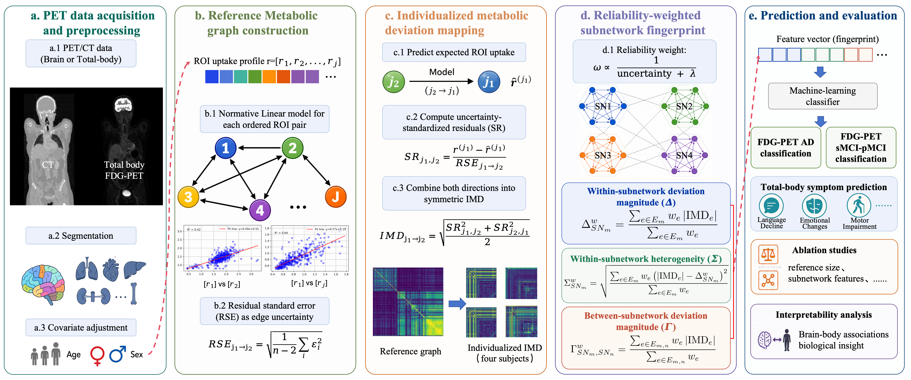
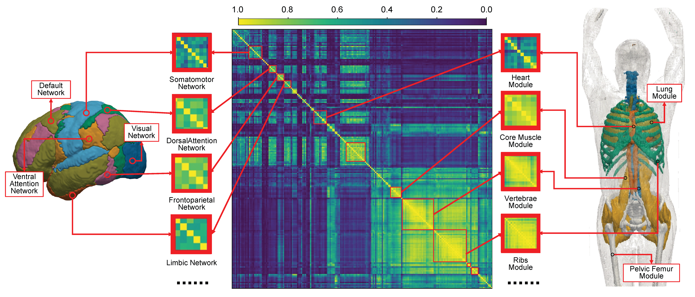
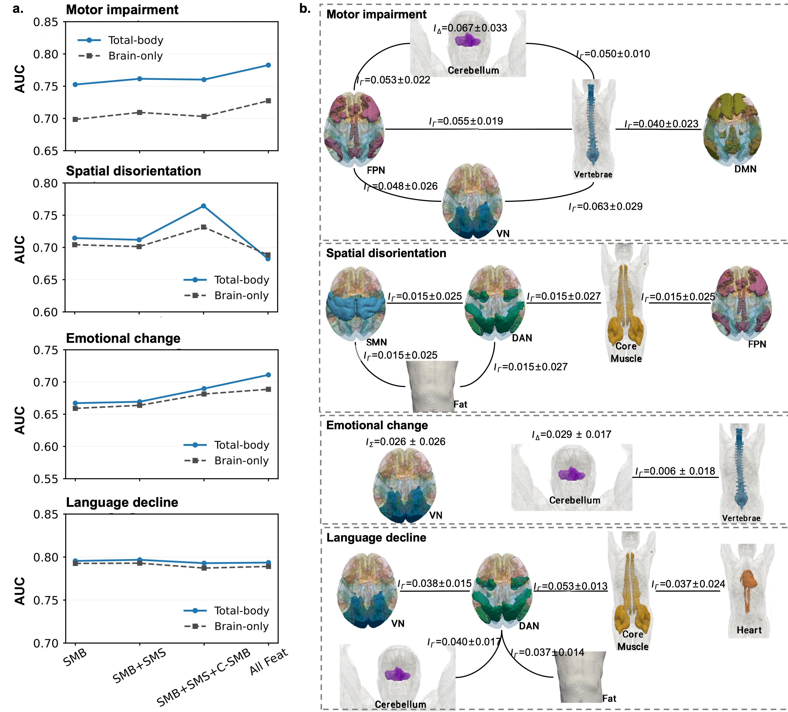

# Reliability-aware Normative Graph Modeling for Individualized ${}^{18}$F-FDG PET Deviation Fingerprinting Across Brain and Total-body Imaging

[](https://huggingface.co/spaces/Chenyixin/TotalBody-18F-FDG-Connectomics)

This repository provides the core implementation of the individualized metabolic deviation fingerprinting framework described in the associated paper.



## Method

The framework characterizes how an individual subject's inter-regional metabolic relationships deviate from a cognitively normal reference.

1. Regional PET uptake values are adjusted for age and sex using cognitively normal training subjects.
2. A directed Reference Metabolic Graph is estimated from pairwise linear prediction models fitted to the adjusted control data.
3. Each target subject is projected onto the graph using prediction-interval-standardized residuals.
4. The two directional residuals for each ROI pair are combined using their root-mean-square magnitude to form a symmetric Individual Metabolic Deviation matrix.
5. Edge-wise deviations are aggregated into reliability-weighted within- and between-subnetwork fingerprints.



The fingerprint contains three feature families:

- Within-subnetwork deviation magnitude, $\Delta^w$.
- Within-subnetwork deviation heterogeneity, $\Sigma^w$.
- Between-subnetwork deviation magnitude, $\Gamma^w$.



## Repository contents

- `imd.py`: demographic adjustment, Reference Metabolic Graph fitting, Individual Metabolic Deviation mapping, reliability weighting, and subnetwork fingerprint construction.
- `example.py`: executable example using synthetic ROI data.
- `tests/test_imd.py`: numerical tests for symmetry, diagonal values, dimensions, and finite outputs.
- `figures/`: figures corresponding to the paper.

## Usage

Install the required packages:

```bash
python -m pip install -r requirements.txt
```

Run the synthetic example:

```bash
python example.py
```

Run the tests:

```bash
python -m pytest
```

## Input requirements

`control_uptake` and `target_uptake` are matrices with subjects in rows and ROIs in columns. Age and sex contain one numeric value per subject. Subnetwork labels contain one label per ROI.

All demographic adjustment parameters, pairwise regression parameters, residual uncertainties, and reliability weights must be estimated from cognitively normal training subjects only. Test subjects must not be used during model fitting.

## Data availability

ADNI data are available through the ADNI data-access platform. The private total-body PET cohort is not publicly distributed because of patient privacy and ethical restrictions. Access may be considered through the corresponding authors, subject to reasonable request and approval by the relevant ethics committee.

## Interactive demonstration

https://huggingface.co/spaces/Chenyixin/TotalBody-18F-FDG-Connectomics
