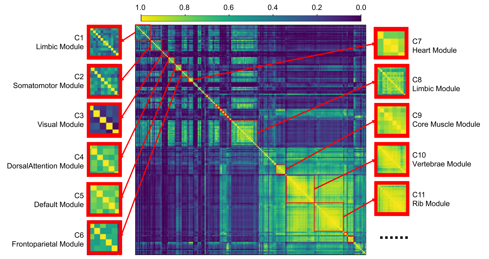

# Total-Body ${}^{18}$F-FDG PET Metabolic Fingerprinting for Alzheimer’s Disease


**A Connectomic Framework for Subnetwork Deviations and Clinical Phenotype Association**

Alzheimer’s disease (AD) is classically defined as a cerebral neurodegenerative disorder. However, accumulating evidence suggests that AD entails **systemic metabolic disturbances** beyond the central nervous system, including sarcopenia, metabolic dysfunction, and reduced pulmonary function. Traditional analyses confined to the brain often miss these clinically relevant whole-body signals.

We propose a novel **Total-Body Metabolic Connectomics** framework. By constructing a normative **Reference Metabolic Connectome (RMC)** from healthy controls and deriving **Individual Metabolic Deviation (IMD)** networks for patients, this method shifts PET interpretation from regional uptake maps to individualized **brain–body deviation networks**.

This repository contains the implementation of the framework, which has been validated to effectively stratify AD patients along heterogeneous clinical dimensions—ranging from memory impairment to motor and emotional deficits—demonstrating the added value of extracranial subnetworks.

---

## 🌟 Key Highlights

### 1. From "Brain-Only" to "Whole-Person"
Unlike traditional pipelines that crop the brain, our framework integrates **202 anatomical regions (ROIs)** covering the brain and peripheral organs (e.g., lungs, heart, muscles, bones) into a unified metabolic graph. We demonstrate that **total-body features outperform brain-only features** for detecting symptoms with systemic physiological components (e.g., spatial disorientation, motor impairment).

### 2. Normative Modeling (RMC & IMD)
- **Reference Metabolic Connectome (RMC):** An age- and sex-adjusted normative atlas modeling the "expected" metabolic coupling between organ pairs in health.
- **Individual Metabolic Deviation (IMD):** A patient-specific network quantifying how much an individual's organ-to-organ coupling deviates from the norm.

### 3. Interpretable Mesoscale Metrics
We move beyond "black box" prediction by summarizing high-dimensional deviations into biologically interpretable metrics:
- **SMB (Intra-Subnetwork Metabolic Bias):** Overall burden of abnormal coupling within a system.
- **SMS (Intra-Subnetwork Metabolic Stability):** Heterogeneity of deviations.
- **C-SMB (Cross-Subnetwork Metabolic Bias):** Disruption in communication between two systems (e.g., Brain–Muscle uncoupling).

### 4. Symptom-Level Stratification
The framework does not just diagnose AD; it profiles **5 distinct clinical phenotypes**:
- **Memory Impairment:** Linked to cerebral DMN deviations.
- **Motor Impairment & Emotional Changes:** Linked to **Cerebellar** and **Brain–Body** couplings.
- **Spatial Disorientation & Language Decline:** Linked to specific cross-network disruptions.

---

## 🛠️ Methodology

The pipeline consists of three core stages:

1. **Universal Segmentation:** Utilizing [MPUM](https://github.com/YixinChen-AI/MPUM) to segment total-body PET/CT into 202 anatomical ROIs.
2. **RMC Construction:** Building the normative baseline using pairwise linear regression on healthy controls.
3. **IMD & Feature Extraction:** Calculating standardized prediction residuals and aggregating them into subnetwork metrics (SMB, SMS, C-SMB).


*Figure: The Reference Metabolic Connectome (RMC) matrix showing normative metabolic correlations between 202 ROIs across the brain and body. Rows and columns are ordered by functional subnetworks.*

---

## 📊 Feature Importance & Clinical Insights

Our analysis reveals that different AD symptoms map onto distinct metabolic subnetwork disruptions. While memory deficits are centrally driven, other symptoms involve significant extracranial components.


*Figure: Permutation-based feature importance for symptom classification. Note the significant contribution of Cerebellar and Brain-Body connections (e.g., Brain-Lung, Brain-Muscle) in non-memory domains.*

---

## 💻 System Requirements

### Hardware Requirements
- **CPU:** Standard computer with sufficient RAM (16GB+ recommended).
- **GPU:** NVIDIA GPU with **>12GB VRAM** (Required for the MPUM segmentation step).

### Software Requirements
**OS:**
- Linux (Tested on Ubuntu 20.04, Rocky Linux)

**Python Dependencies:**
```txt
numpy
tqdm
monai==1.2.0
SimpleITK==2.2.1
sklearn
scipy
